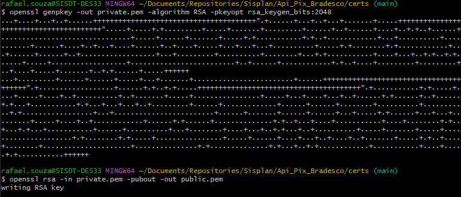
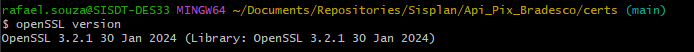
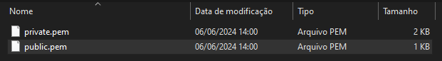

# API Itaú - Geração de Certificado Dinâmico

Este guia descreve como gerar certificados dinâmicos para a API Itaú utilizando o OpenSSL. O OpenSSL é uma ferramenta poderosa para trabalhar com SSL/TLS e está incluída por padrão no Git Bash.

## Pré-requisitos

### Verificar a Presença do OpenSSL

1. Abra o Git Bash.
2. Verifique se o OpenSSL está instalado executando o comando abaixo:

   ```sh
   openSSL version
   ```
   A saida deve ser similar a imagem abaixo
   

### Geração das Credenciais
1. Abra o Git Bash.
2. navegue até o diretório desejado
    ```sh
    cd /caminho/para/o/diretorio
    ```
3. Execute os comandos
    ```sh
    openssl genpkey -out private.pem -algorithm RSA -pkeyopt rsa_keygen_bits:2048
    ```

    ```sh
    openssl rsa -in private.pem -pubout -out public.pem
    ```
   A saida deve ser similar a imagem abaixo
   

   Dois arquivos devem ter sido gerados no diretório
   - `private.pem`: Contém a chave privada RSA de 2048 bits.
   - `public.pem`: Contém a chave pública correspondente.

   

### Validação dos certificados
1. Envie a chave pública (`public.pem`) ao Officercash
